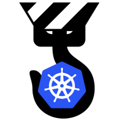

# Environment operator

The purpose of Environment Operator is to provide a seamless application deployment capability for a given environment within Kubernetes. It can easily hook into existing CI/CD pipeline capabilities including our [CI/CD pipeline](https://github.com/pearsontechnology/deployment-pipeline-jenkins-plugin) as well as a typical Jenkins server through a [Jenkins plugin](https://github.com/pearsontechnology/environment-operator-jenkins-plugin).

Each environment (development, staging, production) has its own definition and a separate endpoint to perform deployments.

Currently Environment Operator supports Deployments, Services, Ingresses, MongoDB Statefulsets, and HorizonPodAutoscalers. Users of 
Environment Operator should start with our [User Guide](https://github.com/pearsontechnology/environment-operator/blob/dev/docs/User_Guide.md).

We also provide an [Operations Guide](https://github.com/pearsontechnology/environment-operator/blob/dev/docs/Operatonal_Guide.md) for those deploying and managing Environment Operator itself.

Additionally, for those interested in developing against Environment Operator, check out our [Builder Guide](https://github.com/pearsontechnology/environment-operator/blob/dev/docs/Build.md).

*******************

*******************

**Other documentation on Environment Operator:**

* [Using Docker Registries (Dockerhub, Google Container Registry)](https://github.com/pearsontechnology/environment-operator/blob/dev/docs/Private_Registry.md)
* [Deploying a Mongo Statefulset](https://github.com/pearsontechnology/environment-operator/blob/dev/docs/Mongo.md)

